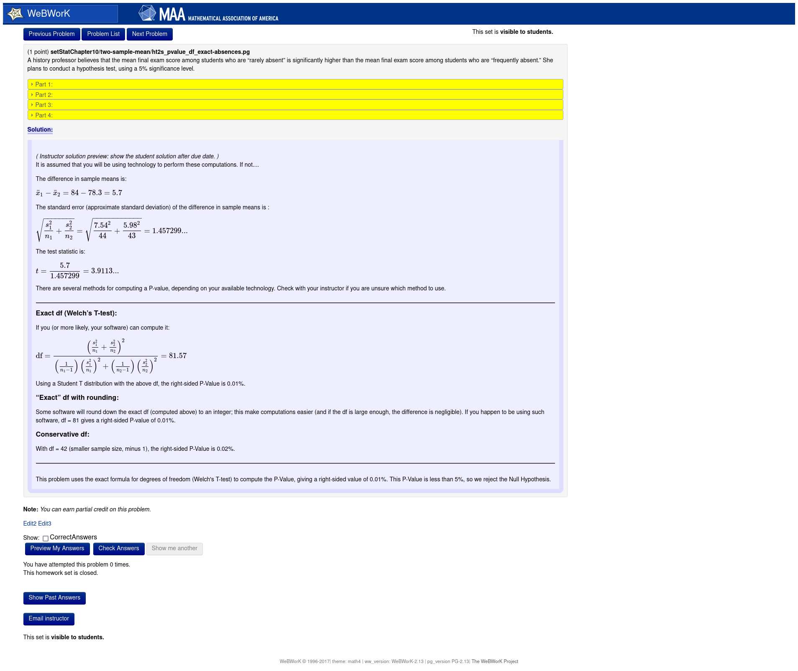
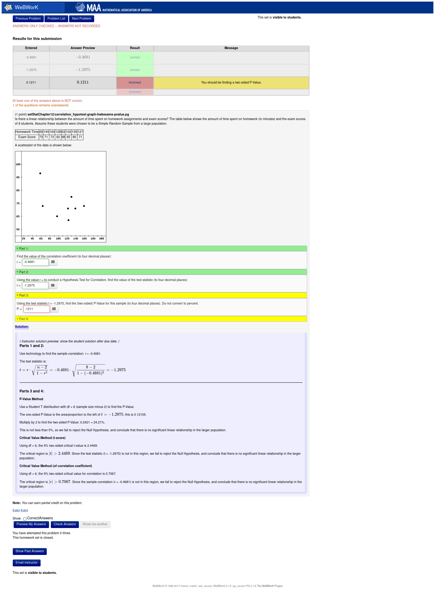

# WebWorK Problems for OpenStax Introductory Statistics

This problem set for Chapters 8-12 of [OpenStax Introductory Statistics](https://openstax.org/details/books/introductory-statistics) was created through a [Round 14 Affordable Learning Georgia Mini-Grant](https://affordablelearninggeorgia.org/about/r14_grantees). The set uses the open-source homework platform [WeBWorK](https://webwork.maa.org/) by the Mathematical Association of America.

Topics include mean with a known or unknown sigma, proportion, two-sample mean and proportion, goodness of fit, homogeneity, independence, correlation, and regression.

## How to use this

We assume you have a functional WeBWorK site and have created a WeBWorK course with appropriate permissions ("instructor" should be sufficient for standard installataions). See the [WeBWorK documentation](https://webwork.maa.org/documentation.html) for further information.

### Uploading the problem sets to your WeBWorK course

***IMPORTANT***: Do not "Download ZIP" directly from this repository. WeBWorK uses tarball (.tgz) as its archive format and will do nothing if you upload a .zip file. You can [download the latest stable .tgz version](stats-minigrant-06_05_2021.tgz) (which contains only the portion of the repository that is needed by WeBWorK); the md5sum is `59e12bc198a2a4ea2e55e729665a462b`. Once you have the .tgz:

1. Log into your WeBWorK course.
2. In the MAIN MENU (usually on the left sidebar), select "File Manager."
3. Ensure that you are in the "templates" directory (shown at the top of the file list).
4. Use the "Browse..." button and select the .tgz file you downloaded above.
5. Format is "Automatic." Both "Unpack archives automatically" and "then delete them" should be checked.
6. Use the "Upload" button and wait.
7. If all goes well, you will receive a message that `230 files unpacked successfully` and the archive was deleted.

Each chapter has its own folder in the course templates directory.

### Using the problem sets in your WeBWorK course

If you are unfamilar with creating/editing problem sets in WeBWorK, see [Creating Problem Sets](https://webwork.maa.org/wiki/Creating_Problem_Sets) on the WeBWorK wiki for general information and screenshots. The main differences here:

* In the Library Browser, use "Local Problems" instead of the "National Problem Library" described in the above tutorial.
* You will not have to select Subject, Chapter, and Section when importing Local Problems.
* These problem collections are named "statChapterXX" where XX is the number of the corresponding OpenStax chapter.
* Many of these problems have Hints and/or Solutions, make sure these are checked if you want to see them.
* Problems meant to be used with a particular technology ([Geogebra](https://www.geogebra.org/classic), for example) have comments to this effect.

### Reporting errors

* Open a new issue; see [#105](https://github.com/PigSupreme/stats-minigrant/issues/105) for an example.
* If you are able to receive email from your WeBWorK course via the "Email Instructor" button, use that and copypaste the ````***** Data about the problem: *****```` section from the automated email.
* If not, please include the source file and random seed (assuming you're able to find the latter).

## Screenshots

#### Two-Sample T-Test for Means, Exact Degrees of Freedom (Aspin-Welch) with auto-generated solutions/feedback:



#### Hypothesis Test for Correlation with Dynamically-Generated Graph and auto-generated solutions/feedback:



----


Content of this repository "Pigsupreme/stats-mingrant" is a derivative of [WebWorK Problems for OpenStax Introductory Statistics](https://alg.manifoldapp.org/projects/webwork-introstats-clayton), published by the University System of Georgia and licensed under a [Creative Commons Attribution 4.0 International License](https://creativecommons.org/licenses/by/4.0/). "Pigsupreme/stats-mingrant" is licensed under [CC-BY 4.0](https://creativecommons.org/licenses/by/4.0/).

Since the original work published for the ALG minigrant is not maintained, all updates and bugfixes are managed here.
